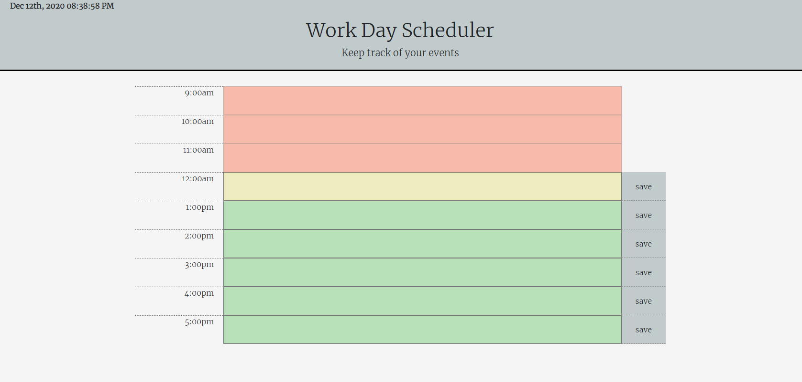

# work-day-scheduler

this is a readme file expalning how it works.

when directed to the site you will be present with calender with today's date and current time at the top.
each time allows the user to save a reminder btween 9am and 5pm.
* once current time passes a time slot that slot becomes part of the past and has ligh coral background and the save button is no longer displayed.
* at the prest time the time slot has a yellow backgorund.
* future time slots have light green backgrounds.

vist ["Work day scheduler"](https://laithalwani.github.io/work-day-scheduler) to give it a try